# DeepAgents 기술 가이드

## 목차

1. [개요 및 아키텍처](#1-개요-및-아키텍처)
2. [create_deep_agent() API](#2-create_deep_agent-api)
3. [Backend 시스템](#3-backend-시스템)
4. [Middleware 시스템](#4-middleware-시스템)
5. [SubAgent 위임 패턴](#5-subagent-위임-패턴)
6. [Filesystem Backend 활용 흐름](#6-filesystem-backend-활용-흐름)
7. [실전 활용 패턴](#7-실전-활용-패턴)
8. [Sandbox Backend 및 명령 실행](#8-sandbox-backend-및-명령-실행)
9. [Filesystem Backend 주의사항 및 Edge Cases](#9-filesystem-backend-주의사항-및-edge-cases)
10. [보안 모범 사례](#10-보안-모범-사례)

---

## 1. 개요 및 아키텍처

### 1.1 DeepAgents란?

DeepAgents는 복잡한 다단계 작업을 처리하는 "Deep Thinking" AI 에이전트를 구축하기 위한 LangChain 기반 프레임워크입니다. 핵심 특징:

- **파일시스템 기반 컨텍스트 관리**: 가상 파일시스템을 통한 장기 메모리
- **SubAgent 위임**: 독립적인 서브에이전트로 작업 병렬 처리
- **자동 컨텍스트 요약**: 170K 토큰 초과 시 자동 메시지 요약
- **Human-in-the-Loop**: 특정 도구 실행 전 사람 승인 요청

### 1.2 전체 아키텍처

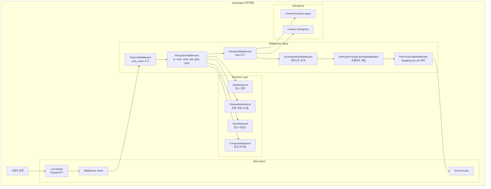

---

## 2. create_deep_agent() API

### 2.1 함수 시그니처

```python
def create_deep_agent(
    model: str | BaseChatModel | None = None,
    tools: Sequence[BaseTool | Callable | dict[str, Any]] | None = None,
    *,
    system_prompt: str | None = None,
    middleware: Sequence[AgentMiddleware] = (),
    subagents: list[SubAgent | CompiledSubAgent] | None = None,
    response_format: ResponseFormat | None = None,
    context_schema: type[Any] | None = None,
    checkpointer: Checkpointer | None = None,
    store: BaseStore | None = None,
    backend: BackendProtocol | BackendFactory | None = None,
    interrupt_on: dict[str, bool | InterruptOnConfig] | None = None,
    debug: bool = False,
    name: str | None = None,
    cache: BaseCache | None = None,
) -> CompiledStateGraph
```

### 2.2 핵심 파라미터 상세

| 파라미터 | 타입 | 기본값 | 설명 |
|---------|------|-------|------|
| `model` | `str \| BaseChatModel` | Claude Sonnet 4.5 | 사용할 LLM. 문자열(`"openai:gpt-4o"`) 또는 BaseChatModel 인스턴스 |
| `tools` | `Sequence[...]` | None | 에이전트에 추가할 커스텀 도구 (내장 도구 외) |
| `backend` | `BackendProtocol \| BackendFactory` | StateBackend | 파일 저장소 백엔드 |
| `subagents` | `list[SubAgent \| CompiledSubAgent]` | None | 커스텀 서브에이전트 정의 |
| `interrupt_on` | `dict[str, bool \| InterruptOnConfig]` | None | HITL 인터럽트 설정 |
| `checkpointer` | `Checkpointer` | None | 대화 상태 영속화 |
| `store` | `BaseStore` | None | 스레드 간 영구 메모리 |

### 2.3 기본 사용 예시

```python
from deepagents import create_deep_agent
from langchain.chat_models import init_chat_model

# 기본 에이전트 (Claude Sonnet 4.5)
agent = create_deep_agent()

# GPT-4.1 사용
model = init_chat_model(model="openai:gpt-4.1")
agent = create_deep_agent(model=model)

# 커스텀 도구 추가
def my_search(query: str) -> str:
    """웹 검색을 수행합니다."""
    return f"검색 결과: {query}"

agent = create_deep_agent(
    model=model,
    tools=[my_search],
    system_prompt="당신은 리서치 전문가입니다."
)
```

### 2.4 자동 주입되는 내장 도구

| 도구 | 출처 | 기능 |
|-----|------|------|
| `write_todos` | TodoListMiddleware | 작업 목록 관리 (pending, in_progress, completed) |
| `ls` | FilesystemMiddleware | 디렉토리 내용 조회 |
| `read_file` | FilesystemMiddleware | 파일 읽기 (offset/limit 페이지네이션) |
| `write_file` | FilesystemMiddleware | 새 파일 생성 |
| `edit_file` | FilesystemMiddleware | 기존 파일 편집 (문자열 치환) |
| `glob` | FilesystemMiddleware | 패턴으로 파일 검색 |
| `grep` | FilesystemMiddleware | 파일 내용 검색 |
| `execute` | FilesystemMiddleware | 쉘 명령 실행 (SandboxBackend 필요) |
| `task` | SubAgentMiddleware | 서브에이전트 호출 |

---

## 3. Backend 시스템

Backend는 DeepAgent의 파일 저장소 추상화 계층입니다.  
모든 Backend는 `BackendProtocol`을 구현합니다.

### 3.1 BackendProtocol 인터페이스

```python
class BackendProtocol(ABC):
    # 파일 목록 조회
    def ls_info(self, path: str) -> list[FileInfo]
    async def als_info(self, path: str) -> list[FileInfo]

    # 파일 읽기 (페이지네이션 지원)
    def read(self, file_path: str, offset: int = 0, limit: int = 2000) -> str
    async def aread(self, file_path: str, offset: int = 0, limit: int = 2000) -> str

    # 파일 쓰기 (새 파일만, 기존 파일은 에러)
    def write(self, file_path: str, content: str) -> WriteResult
    async def awrite(self, file_path: str, content: str) -> WriteResult

    # 파일 편집 (문자열 치환)
    def edit(self, file_path: str, old_string: str, new_string: str, replace_all: bool = False) -> EditResult
    async def aedit(self, file_path: str, old_string: str, new_string: str, replace_all: bool = False) -> EditResult

    # 검색
    def grep_raw(self, pattern: str, path: str | None = None, glob: str | None = None) -> list[GrepMatch] | str
    def glob_info(self, pattern: str, path: str = "/") -> list[FileInfo]

    # 벌크 작업
    def upload_files(self, files: list[tuple[str, bytes]]) -> list[FileUploadResponse]
    def download_files(self, paths: list[str]) -> list[FileDownloadResponse]
```

### 3.2 Backend 구현체 비교

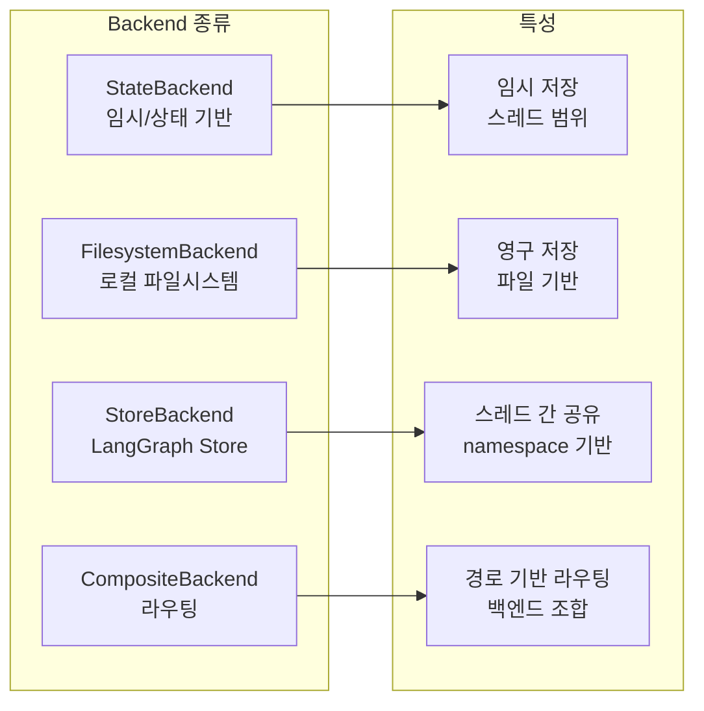

| Backend | 저장 위치 | 수명 | files_update 반환 | 사용 시나리오 |
|---------|----------|------|------------------|--------------|
| **StateBackend** | LangGraph State | 대화 스레드 | (상태 업데이트용) | 임시 작업 파일 |
| **FilesystemBackend** | 로컬 디스크 | 영구 | (이미 저장됨) | 실제 파일 조작 |
| **StoreBackend** | LangGraph Store | 스레드 간 영구 | (이미 저장됨) | 장기 메모리 |
| **CompositeBackend** | 라우팅 | 백엔드별 상이 | 백엔드별 상이 | 하이브리드 |

### 3.3 StateBackend 상세

LangGraph 상태에 파일을 저장하는 임시 백엔드입니다.

```python
class StateBackend(BackendProtocol):
    def __init__(self, runtime: ToolRuntime):
        self.runtime = runtime

    def read(self, file_path: str, offset: int = 0, limit: int = 2000) -> str:
        files = self.runtime.state.get("files", {})
        file_data = files.get(file_path)
        if file_data is None:
            return f"Error: File '{file_path}' not found"
        return format_read_response(file_data, offset, limit)

    def write(self, file_path: str, content: str) -> WriteResult:
        files = self.runtime.state.get("files", {})
        if file_path in files:
            return WriteResult(error=f"Cannot write to {file_path} because it already exists...")
        new_file_data = create_file_data(content)
        return WriteResult(path=file_path, files_update={file_path: new_file_data})
```

**FileData 구조**:
```python
class FileData(TypedDict):
    content: list[str]      # 파일 내용 (줄 단위)
    created_at: str         # ISO 8601 타임스탬프
    modified_at: str        # ISO 8601 타임스탬프
```

### 3.4 FilesystemBackend 상세

로컬 파일시스템에 직접 접근하는 백엔드입니다.

```python
class FilesystemBackend(BackendProtocol):
    def __init__(
        self,
        root_dir: str | Path | None = None,
        virtual_mode: bool = False,      # 가상 경로 모드 (샌드박싱)
        max_file_size_mb: int = 10,
    ):
        self.cwd = Path(root_dir).resolve() if root_dir else Path.cwd()
        self.virtual_mode = virtual_mode
```

**보안 기능**:
- `virtual_mode=True`: 모든 경로가 `root_dir` 하위로 제한 (디렉토리 탈출 방지)
- `O_NOFOLLOW` 플래그: 심볼릭 링크 따라가기 방지
- Path traversal 차단: `..`, `~` 패턴 거부

**검색 최적화**:
- 1차: ripgrep (`rg`) JSON 출력 사용
- 2차: Python 폴백 (Ripgrep 미설치 시)

### 3.5 CompositeBackend 상세

경로 접두사 기반으로 여러 백엔드를 라우팅합니다.

```python
class CompositeBackend:
    def __init__(
        self,
        default: BackendProtocol | StateBackend,  # 기본 백엔드
        routes: dict[str, BackendProtocol],       # 접두사 -> 백엔드 매핑
    ):
        self.default = default
        self.routes = routes
        # 가장 긴 접두사부터 매칭 (longest-prefix matching)
        self.sorted_routes = sorted(routes.items(), key=lambda x: len(x[0]), reverse=True)
```

**사용 예시**:
```python
from deepagents.backends import StateBackend, StoreBackend, FilesystemBackend, CompositeBackend

backend = CompositeBackend(
    default=StateBackend,  # / 하위 기본
    routes={
        "/memories/": StoreBackend,   # 장기 메모리 (영구)
        "/workspace/": FilesystemBackend(root_dir="/tmp/agent", virtual_mode=True),
    }
)

agent = create_deep_agent(backend=backend)
```

**라우팅 동작**:
```
/notes.txt           → StateBackend (default)
/memories/facts.txt  → StoreBackend
/workspace/code.py   → FilesystemBackend
```

---

## 4. Middleware 시스템

Middleware는 에이전트의 모델 호출과 도구 실행을 가로채서 기능을 주입합니다.

### 4.1 Middleware 적용 순서

`create_deep_agent()`가 생성하는 미들웨어 스택:

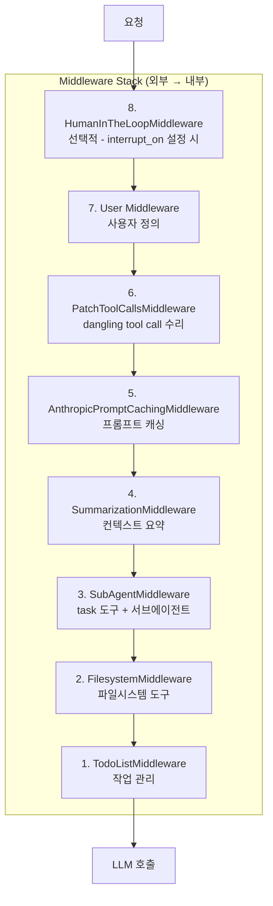

### 4.2 AgentMiddleware 인터페이스

```python
class AgentMiddleware(ABC):
    # 상태 스키마 확장
    state_schema: type[AgentState] | None = None

    # 주입할 도구
    tools: list[BaseTool] = []

    # 모델 호출 래핑 (시스템 프롬프트 수정, 도구 필터링 등)
    def wrap_model_call(self, request: ModelRequest, handler: Callable) -> ModelResponse
    async def awrap_model_call(self, request: ModelRequest, handler: Callable) -> ModelResponse

    # 도구 호출 래핑 (결과 가로채기, 상태 업데이트 등)
    def wrap_tool_call(self, request: ToolCallRequest, handler: Callable) -> ToolMessage | Command
    async def awrap_tool_call(self, request: ToolCallRequest, handler: Callable) -> ToolMessage | Command

    # 에이전트 실행 전 훅
    def before_agent(self, state: AgentState, runtime: Runtime) -> dict | None
```

### 4.3 FilesystemMiddleware

파일시스템 도구를 주입하고 대용량 결과를 자동 관리합니다.

```python
class FilesystemMiddleware(AgentMiddleware):
    state_schema = FilesystemState  # files: dict[str, FileData] 추가

    def __init__(
        self,
        backend: BACKEND_TYPES | None = None,
        system_prompt: str | None = None,
        custom_tool_descriptions: dict[str, str] | None = None,
        tool_token_limit_before_evict: int | None = 20000,  # 대용량 결과 기준
    )
```

**대용량 결과 자동 처리**:
- 도구 결과가 `4 × tool_token_limit_before_evict` (기본 80,000자) 초과 시
- `/large_tool_results/{tool_call_id}` 경로에 자동 저장
- 에이전트에게는 처음 10줄 샘플 + 파일 참조 메시지 반환
- 에이전트가 `read_file`로 페이지네이션 읽기 가능

### 4.4 SubAgentMiddleware

서브에이전트 생성 및 `task` 도구를 주입합니다.

```python
class SubAgentMiddleware(AgentMiddleware):
    def __init__(
        self,
        default_model: str | BaseChatModel,
        default_tools: Sequence[...] | None = None,
        default_middleware: list[AgentMiddleware] | None = None,
        default_interrupt_on: dict[...] | None = None,
        subagents: list[SubAgent | CompiledSubAgent] | None = None,
        system_prompt: str | None = TASK_SYSTEM_PROMPT,
        general_purpose_agent: bool = True,  # 기본 범용 에이전트 포함
        task_description: str | None = None,
    )
```

**SubAgent 정의**:
```python
class SubAgent(TypedDict):
    name: str                           # 에이전트 식별자
    description: str                    # 메인 에이전트에게 보여줄 설명
    system_prompt: str                  # 서브에이전트 시스템 프롬프트
    tools: Sequence[...]                # 사용 가능한 도구
    model: NotRequired[str | BaseChatModel]  # 모델 오버라이드
    middleware: NotRequired[list[AgentMiddleware]]  # 추가 미들웨어
    interrupt_on: NotRequired[dict[...]]  # HITL 설정
```

### 4.5 SummarizationMiddleware

컨텍스트 오버플로우 방지를 위한 자동 메시지 요약입니다.

```python
SummarizationMiddleware(
    model=model,
    trigger=("fraction", 0.85),  # 컨텍스트의 85% 도달 시 요약
    keep=("fraction", 0.10),      # 최근 10% 유지
)
```

**트리거 조건**:
- `("fraction", 0.85)`: 모델 컨텍스트의 85% 도달 시
- `("tokens", 170000)`: 170K 토큰 도달 시 (모델 정보 없을 때)

### 4.6 PatchToolCallsMiddleware

"Dangling tool call" 문제를 해결합니다.

**문제 상황**: AIMessage에 `tool_calls`가 있지만 대응하는 `ToolMessage`가 없는 경우

**해결 방법**: `before_agent` 훅에서 누락된 ToolMessage를 자동 생성
```python
ToolMessage(
    content="Tool call was cancelled or did not complete.",
    tool_call_id=dangling_tool_call_id
)
```

---

## 5. SubAgent 위임 패턴

### 5.1 SubAgent 동작 원리

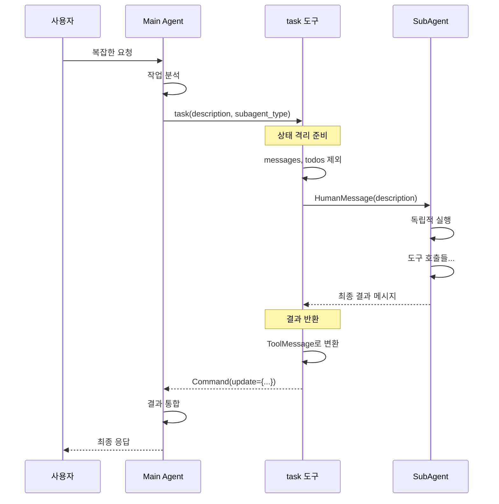

### 5.2 상태 격리 메커니즘

**제외되는 상태 키** (`_EXCLUDED_STATE_KEYS`):
```python
{"messages", "todos", "structured_response"}
```

- `messages`: 서브에이전트는 독립적인 대화 컨텍스트를 가짐
- `todos`: 작업 목록 충돌 방지
- `structured_response`: 스키마 충돌 방지

**전달되는 상태**: 위 키를 제외한 모든 커스텀 상태 (예: `files`, 사용자 정의 상태)

### 5.3 병렬 SubAgent 실행

메인 에이전트가 한 번의 응답에서 여러 `task` 도구를 호출하면 병렬 실행됩니다:

```python
# LLM이 생성하는 응답
AIMessage(
    tool_calls=[
        {"name": "task", "args": {"description": "Python 조사", "subagent_type": "general-purpose"}},
        {"name": "task", "args": {"description": "JavaScript 조사", "subagent_type": "general-purpose"}},
        {"name": "task", "args": {"description": "Rust 조사", "subagent_type": "general-purpose"}},
    ]
)
```

각 서브에이전트는:
- 독립적인 상태 복사본으로 실행
- 병렬 처리되어 성능 최적화
- 개별 `ToolMessage`로 결과 반환

### 5.4 커스텀 SubAgent 정의

```python
research_agent = {
    "name": "researcher",
    "description": "심층 리서치가 필요한 질문에 사용",
    "system_prompt": """당신은 전문 리서처입니다.
    - 최대 5번의 검색 수행
    - 출처 명시 필수
    - 결과를 구조화된 형식으로 반환""",
    "tools": [tavily_search, think_tool],
    "model": "openai:gpt-4o",  # 선택적 모델 오버라이드
}

agent = create_deep_agent(
    model=model,
    subagents=[research_agent],
)
```

---

## 6. Filesystem Backend 활용 흐름

### 6.1 전체 데이터 흐름

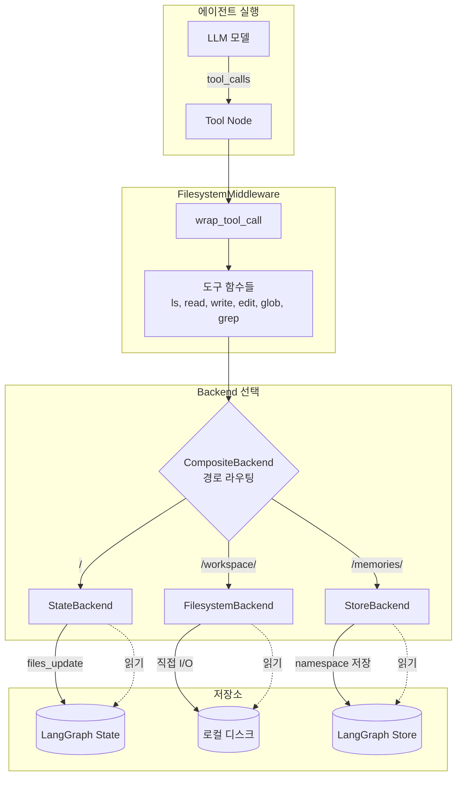

### 6.2 파일 쓰기 흐름 상세

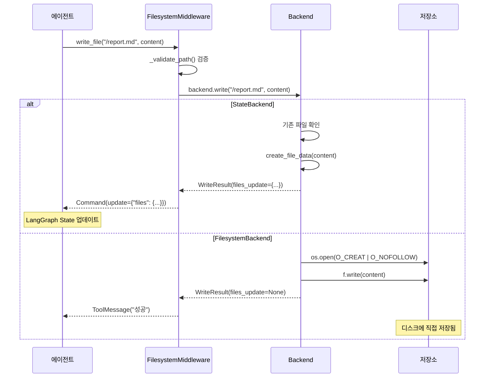

### 6.3 대용량 결과 처리 흐름

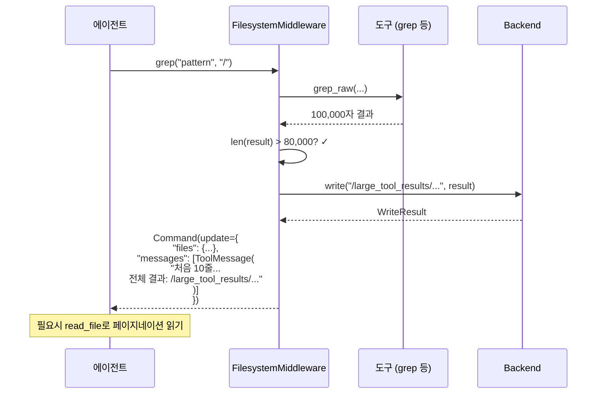

### 6.4 CompositeBackend 라우팅 흐름

```mermaid
flowchart TD
    subgraph "CompositeBackend"
        Input[파일 경로 입력]
        Route{longest-prefix<br/>매칭}

        Route -->|"/memories/*"| MemStrip[접두사 제거<br/>"/memories/note.txt" → "/note.txt"]
        Route -->|"/workspace/*"| WorkStrip[접두사 제거<br/>"/workspace/code.py" → "/code.py"]
        Route -->|"/*" 기타| Default[기본 백엔드<br/>경로 유지]

        MemStrip --> Store[StoreBackend]
        WorkStrip --> FS[FilesystemBackend]
        Default --> State[StateBackend]

        Store --> MemResult[결과에 접두사 복원]
        FS --> WorkResult[결과에 접두사 복원]
        State --> DefaultResult[결과 그대로]
    end

    Input --> Route
```

### 6.5 실제 구현 예시: 리서치 에이전트

```python
from deepagents import create_deep_agent
from deepagents.backends import CompositeBackend, StateBackend, FilesystemBackend
from langchain.chat_models import init_chat_model

# 백엔드 구성
backend = CompositeBackend(
    default=StateBackend,  # 팩토리 (런타임에 인스턴스화)
    routes={
        "/research/": FilesystemBackend(
            root_dir="./research_workspace",
            virtual_mode=True,
        ),
    }
)

# 커스텀 도구
def tavily_search(query: str, max_results: int = 3) -> str:
    """웹 검색을 수행합니다."""
    # Tavily API 호출...
    return results

def think_tool(reflection: str) -> str:
    """전략적 사고를 위한 도구입니다."""
    return "생각이 기록되었습니다."

# 에이전트 생성
agent = create_deep_agent(
    model=init_chat_model("openai:gpt-4o"),
    tools=[tavily_search, think_tool],
    backend=backend,
    system_prompt="""당신은 리서치 전문가입니다.

## 워크플로우
1. 요청 분석 → /research/request.md에 저장
2. 검색 수행 (최대 5회)
3. 결과 종합 → /research/report.md에 저장
4. 검증 및 완료

## 규칙
- 검색 전 항상 think_tool로 전략 수립
- 출처는 반드시 명시
- 결과는 구조화된 마크다운으로 작성
""",
)

# 실행
result = agent.invoke({
    "messages": [HumanMessage(content="2024년 AI 에이전트 트렌드 조사해줘")]
})
```

---

## 7. 실전 활용 패턴

### 7.1 Human-in-the-Loop 설정

```python
agent = create_deep_agent(
    model=model,
    interrupt_on={
        "write_file": True,           # 모든 파일 쓰기에 승인 요청
        "execute": {                   # 명령 실행에 상세 설정
            "type": "tool",
            "action_description": "쉘 명령 실행",
        },
        "task": False,                 # 서브에이전트 호출은 자동 허용
    }
)

# 스트리밍으로 인터럽트 처리
for event in agent.stream({"messages": [...]}, stream_mode="updates"):
    if "interrupt" in event:
        # 사용자 승인 요청 UI 표시
        approved = get_user_approval(event["interrupt"])
        if not approved:
            break
```

### 7.2 장기 메모리 구성

```python
from langgraph.checkpoint.memory import MemorySaver
from langgraph.store.memory import InMemoryStore

# 체크포인터: 대화 상태 저장
checkpointer = MemorySaver()

# 스토어: 스레드 간 공유 메모리
store = InMemoryStore()

# 백엔드: 메모리 경로 설정
backend = CompositeBackend(
    default=StateBackend,
    routes={
        "/memories/": StoreBackend,  # 영구 메모리
    }
)

agent = create_deep_agent(
    model=model,
    checkpointer=checkpointer,
    store=store,
    backend=backend,
)

# thread_id로 대화 연속성 유지
config = {"configurable": {"thread_id": "user_123"}}
result = agent.invoke({"messages": [...]}, config=config)
```

### 7.3 전문화된 SubAgent 팀 구성

```python
# 리서처 에이전트
researcher = {
    "name": "researcher",
    "description": "심층 웹 리서치가 필요할 때 사용",
    "system_prompt": "당신은 리서치 전문가입니다...",
    "tools": [tavily_search, think_tool],
}

# 코더 에이전트
coder = {
    "name": "coder",
    "description": "코드 작성이나 기술 구현이 필요할 때 사용",
    "system_prompt": "당신은 시니어 개발자입니다...",
    "tools": [],  # 파일시스템 도구만 사용
}

# 리뷰어 에이전트
reviewer = {
    "name": "reviewer",
    "description": "결과물 검토 및 품질 확인이 필요할 때 사용",
    "system_prompt": "당신은 QA 전문가입니다...",
    "tools": [],
}

agent = create_deep_agent(
    model=model,
    subagents=[researcher, coder, reviewer],
    system_prompt="""당신은 프로젝트 매니저입니다.

복잡한 작업은 적절한 서브에이전트에게 위임하세요:
- 정보 수집 → researcher
- 구현 → coder
- 검증 → reviewer

병렬 실행이 가능한 작업은 동시에 여러 task 도구를 호출하세요.
""",
)
```

### 7.4 디버깅 및 모니터링

```python
# LangSmith 트레이싱 활성화
import os
os.environ["LANGSMITH_API_KEY"] = "lsv2_pt_..."
os.environ["LANGSMITH_TRACING"] = "true"
os.environ["LANGSMITH_PROJECT"] = "my-deepagent"

# 디버그 모드
agent = create_deep_agent(
    model=model,
    debug=True,
    name="ResearchAgent",  # 그래프 이름 지정
)

# 그래프 구조 시각화
print(agent.get_graph().draw_mermaid())
```

---

## 부록: 주요 타입 정의

### FileInfo
```python
class FileInfo(TypedDict):
    path: str                          # 필수
    is_dir: NotRequired[bool]
    size: NotRequired[int]             # 바이트
    modified_at: NotRequired[str]      # ISO 8601
```

### WriteResult / EditResult
```python
@dataclass
class WriteResult:
    error: str | None = None
    path: str | None = None
    files_update: dict[str, Any] | None = None  # StateBackend용

@dataclass
class EditResult:
    error: str | None = None
    path: str | None = None
    files_update: dict[str, Any] | None = None
    occurrences: int | None = None
```

### GrepMatch
```python
class GrepMatch(TypedDict):
    path: str    # 파일 경로
    line: int    # 줄 번호 (1부터)
    text: str    # 매칭된 줄 내용
```

### ExecuteResponse
```python
@dataclass
class ExecuteResponse:
    output: str                # stdout + stderr
    exit_code: int | None = None
    truncated: bool = False    # 출력 잘림 여부
```

---

## 8. Sandbox Backend 및 명령 실행

DeepAgent는 격리된 환경에서 쉘 명령을 실행할 수 있는 Sandbox 시스템을 제공합니다.

### 8.1 SandboxBackendProtocol

`BackendProtocol`을 확장하여 명령 실행 기능을 추가합니다:

```python
class SandboxBackendProtocol(BackendProtocol):
    def execute(self, command: str) -> ExecuteResponse:
        """쉘 명령을 실행하고 결과를 반환합니다."""

    async def aexecute(self, command: str) -> ExecuteResponse:
        """비동기 버전"""

    @property
    def id(self) -> str:
        """샌드박스 고유 식별자"""
```

### 8.2 BaseSandbox 구현

모든 Sandbox 구현의 기반 클래스로, 파일 작업을 쉘 명령으로 변환합니다:

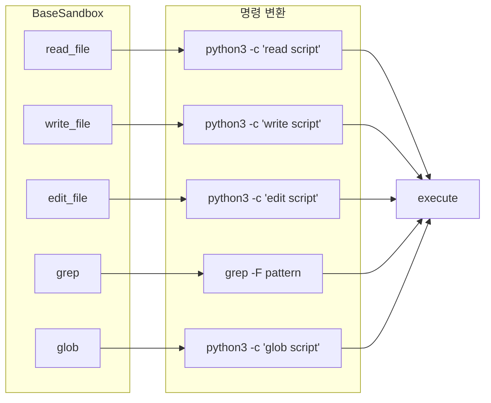

**보안 패턴 - Base64 인코딩**:
```python
# 모든 페이로드는 Base64로 인코딩되어 쉘 인젝션 방지
_WRITE_COMMAND_TEMPLATE = """python3 -c "
import base64
content = base64.b64decode('{content_b64}').decode('utf-8')
with open('{file_path}', 'w') as f:
    f.write(content)
" 2>&1"""
```

### 8.3 Harbor 통합 (Docker 기반)

`HarborSandbox`는 Docker 컨테이너에서 명령을 실행합니다:

```python
class HarborSandbox(SandboxBackendProtocol):
    def __init__(self, environment: BaseEnvironment):
        self.environment = environment  # Harbor 환경

    async def aexecute(self, command: str) -> ExecuteResponse:
        result = await self.environment.exec(command)
        return ExecuteResponse(
            output=self._filter_tty_noise(result.stdout + result.stderr),
            exit_code=result.exit_code,
        )
```

**TTY 노이즈 필터링**:
- `"cannot set terminal process group (-1)"` 제거
- `"no job control in this shell"` 제거
- `"initialize_job_control: Bad file descriptor"` 제거

### 8.4 Sandbox 프로바이더

| 프로바이더 | 작업 디렉토리 | 특징 |
|-----------|-------------|------|
| **Modal** | `/workspace` | 클라우드 함수 기반, 임시 |
| **Runloop** | `/home/user` | 클라우드 devbox, ID로 재사용 가능 |
| **Daytona** | `/home/daytona` | 클라우드 워크스페이스 |

**프로바이더 사용 예시**:
```python
from deepagents_cli.integrations.sandbox_factory import create_sandbox

with create_sandbox(
    provider="modal",
    setup_script_path="./setup.sh",  # 초기화 스크립트
) as sandbox:
    result = sandbox.execute("python3 --version")
    print(result.output)
```

### 8.5 Sandbox 선택 가이드

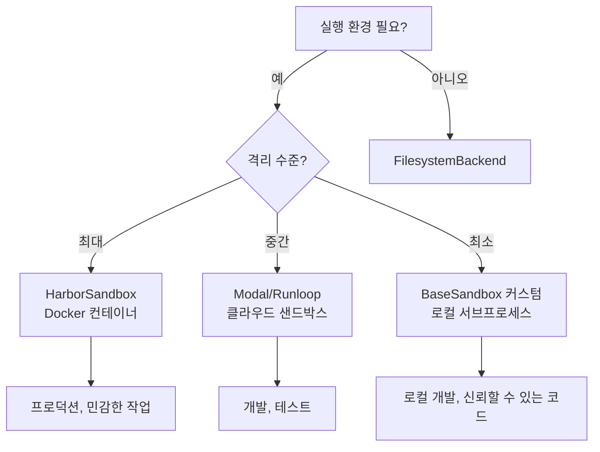

---

## 9. Filesystem Backend 주의사항 및 Edge Cases

### 9.1 주요 Gotcha 요약

| 이슈 | 심각도 | 영향 | 해결 방법 |
|-----|-------|------|----------|
| Windows에서 Symlink following | 높음 | 보안: 경로 탈출 가능 | `virtual_mode=True` 사용 |
| Non-UTF-8 인코딩 미지원 | 중간 | 일부 파일 읽기/쓰기 실패 | 사전에 인코딩 변환 |
| `max_file_size_mb`가 grep에만 적용 | 중간 | 대용량 파일 읽기 시 메모리 문제 | 페이지네이션 사용 |
| 권한 오류 무시 | 높음 | 불완전한 디렉토리 목록 | 로그 모니터링 |
| TOCTOU 레이스 컨디션 | 높음 | 동시 쓰기 실패 | 단일 스레드 사용 또는 재시도 로직 |
| 빈 파일 경고 메시지 반환 | 중간 | API 일관성 문제 | 에러 문자열 파싱 |

### 9.2 경로 검증 상세

**FilesystemMiddleware의 `_validate_path()` 함수**:

```python
def _validate_path(path: str, *, allowed_prefixes: Sequence[str] | None = None) -> str:
    # 1. Path traversal 차단
    if ".." in path or path.startswith("~"):
        raise ValueError(f"Path traversal not allowed: {path}")

    # 2. Windows 절대 경로 거부
    if re.match(r"^[a-zA-Z]:", path):  # C:, D:, 등
        raise ValueError(f"Windows absolute paths are not supported: {path}")

    # 3. 정규화 (// 제거, . 제거)
    normalized = os.path.normpath(path).replace("\\", "/")

    # 4. 선행 슬래시 보장
    if not normalized.startswith("/"):
        normalized = f"/{normalized}"

    # 5. 허용된 접두사 검증 (선택)
    if allowed_prefixes is not None:
        if not any(normalized.startswith(prefix) for prefix in allowed_prefixes):
            raise ValueError(f"Path must start with one of {allowed_prefixes}")

    return normalized
```

**검증 예시**:
```python
_validate_path("foo/bar")           # → "/foo/bar" ✓
_validate_path("/./foo//bar")       # → "/foo/bar" ✓
_validate_path("../etc/passwd")     # → ValueError ✗
_validate_path("C:\\Users\\file")   # → ValueError ✗
_validate_path("/data/f.txt", allowed_prefixes=["/data/"])  # ✓
_validate_path("/etc/f.txt", allowed_prefixes=["/data/"])   # → ValueError ✗
```

### 9.3 Symlink 보안

```python
# FilesystemBackend에서 O_NOFOLLOW 사용
fd = os.open(resolved_path, os.O_RDONLY | getattr(os, "O_NOFOLLOW", 0))
```

**플랫폼별 동작**:
- **Linux/macOS**: `O_NOFOLLOW`가 symlink following 방지
- **Windows**: `O_NOFOLLOW` 미지원, symlink 따라감 ⚠️

**권장 사항**: Windows 환경에서는 반드시 `virtual_mode=True` 사용

### 9.4 인코딩 처리

모든 텍스트 작업은 **UTF-8 전용**:

```python
# 읽기/쓰기 모두 UTF-8
with os.fdopen(fd, "r", encoding="utf-8") as f:
    content = f.read()
```

**Non-UTF-8 파일 처리 시**:
```python
# 사전 변환 필요
with open(path, "r", encoding="latin-1") as f:
    content = f.read()
utf8_content = content.encode("utf-8").decode("utf-8")
```

### 9.5 Edit 작업 주의사항

**`replace_all` 플래그 동작**:

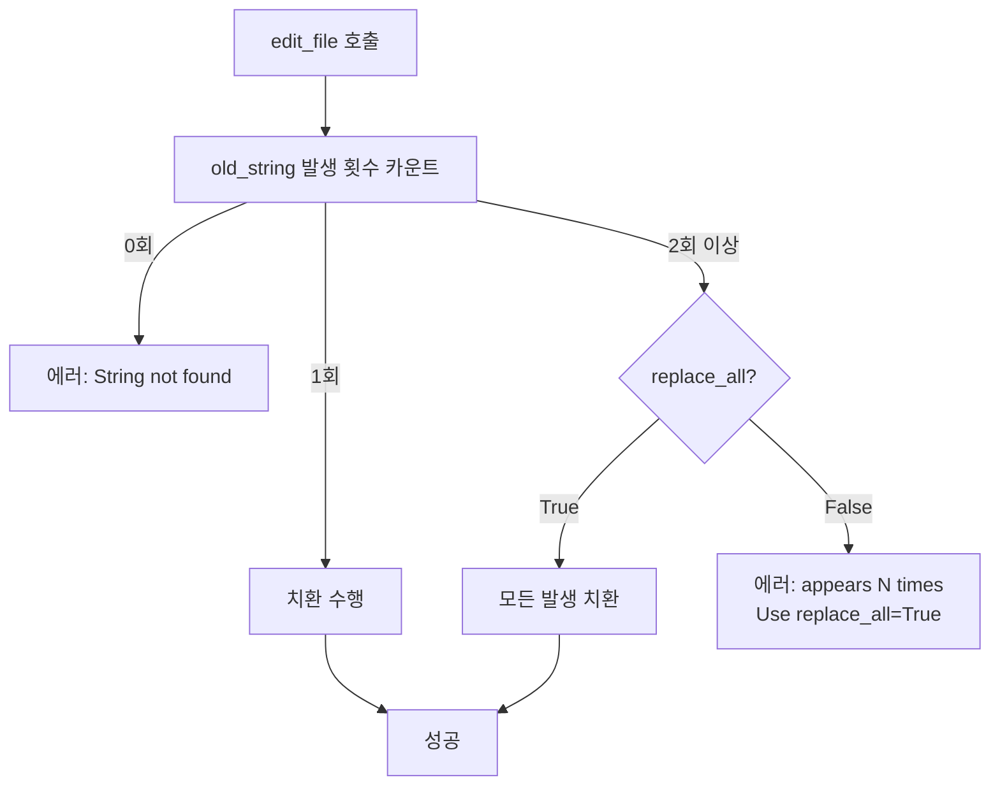

**예시**:
```python
# 파일 내용: "hello world hello"

# ❌ 실패 - 2회 발생
result = be.edit("/file.txt", "hello", "hi", replace_all=False)
# → "Error: String 'hello' appears 2 times in file. Use replace_all=True..."

# ✓ 성공
result = be.edit("/file.txt", "hello", "hi", replace_all=True)
# → occurrences=2
```

### 9.6 대용량 파일 처리

**제한 및 임계값**:

| 설정 | 값 | 적용 대상 |
|------|------|----------|
| `max_file_size_mb` | 10 MB | grep 검색에서 스킵 |
| `tool_token_limit_before_evict` | 20,000 토큰 | 결과 자동 저장 임계값 |
| `read()` limit | 2,000 줄 | 페이지네이션 기본값 |
| 줄 길이 제한 | 10,000 자 | 포맷팅 시 분할 |

**대용량 파일 읽기 패턴**:
```python
# 처음 100줄 읽기
content = backend.read("/large_file.txt", offset=0, limit=100)

# 다음 100줄 읽기
content = backend.read("/large_file.txt", offset=100, limit=100)
```

### 9.7 동시성 주의

**TOCTOU (Time-of-Check-Time-of-Use) 문제**:

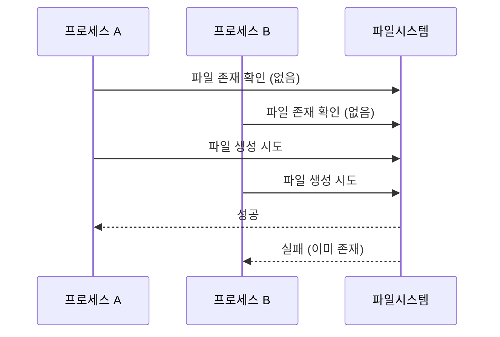

**해결 방법**:
1. 단일 스레드/프로세스로 파일 작업 제한
2. 실패 시 재시도 로직 구현
3. 외부 잠금 메커니즘 사용

### 9.8 에러 반환 패턴

**두 가지 에러 패턴 혼재**:

| 함수 | 반환 타입 | 에러 표현 |
|------|----------|----------|
| `read()` | `str` | 에러 문자열 직접 반환 |
| `grep_raw()` | `list[GrepMatch] \| str` | 에러 시 문자열 |
| `write()` | `WriteResult` | `.error` 필드 |
| `edit()` | `EditResult` | `.error` 필드 |
| `upload_files()` | `list[FileUploadResponse]` | 각 항목의 `.error` 필드 |

**안전한 에러 처리**:
```python
# read() 결과 처리
result = backend.read("/file.txt")
if result.startswith("Error:"):
    handle_error(result)
else:
    process_content(result)

# grep_raw() 결과 처리
result = backend.grep_raw("pattern", "/")
if isinstance(result, str):  # 에러 문자열
    handle_error(result)
else:  # list[GrepMatch]
    process_matches(result)
```

---

## 10. 보안 모범 사례

### 10.1 방어 계층

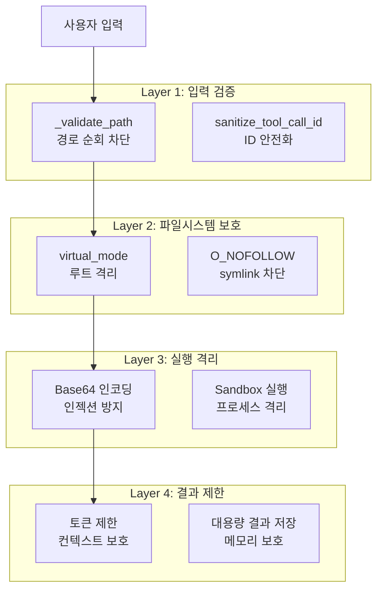

### 10.2 보안 체크리스트

```python
# ✓ 프로덕션 설정 예시
agent = create_deep_agent(
    model=model,
    backend=CompositeBackend(
        default=StateBackend,  # 임시 파일은 상태에
        routes={
            "/workspace/": FilesystemBackend(
                root_dir="./sandbox",
                virtual_mode=True,       # ✓ 필수: 경로 격리
                max_file_size_mb=5,      # ✓ 권장: 파일 크기 제한
            ),
        }
    ),
    middleware=[
        FilesystemMiddleware(
            tool_token_limit_before_evict=10000,  # ✓ 권장: 결과 크기 제한
        )
    ],
    interrupt_on={
        "execute": True,    # ✓ 필수: 명령 실행 전 승인
        "write_file": True, # ✓ 권장: 파일 쓰기 전 승인
    },
)
```

### 10.3 민감한 경로 보호

```python
# allowed_prefixes로 접근 제한
def create_restricted_backend(runtime):
    return FilesystemBackend(
        root_dir="./data",
        virtual_mode=True,
    )

# 미들웨어에서 경로 검증
class RestrictedFilesystemMiddleware(FilesystemMiddleware):
    def _validate_path(self, path):
        # 추가 검증 로직
        if "/secrets/" in path or "/.env" in path:
            raise ValueError("Access to sensitive paths is forbidden")
        return super()._validate_path(path)
```

---

## 참고 자료

- [DeepAgents 공식 문서](https://docs.langchain.com/oss/python/deepagents/overview)
- [LangGraph 문서](https://langchain-ai.github.io/langgraph/)
- [소스코드 참조](./deepagents_sourcecode/libs/deepagents/)
