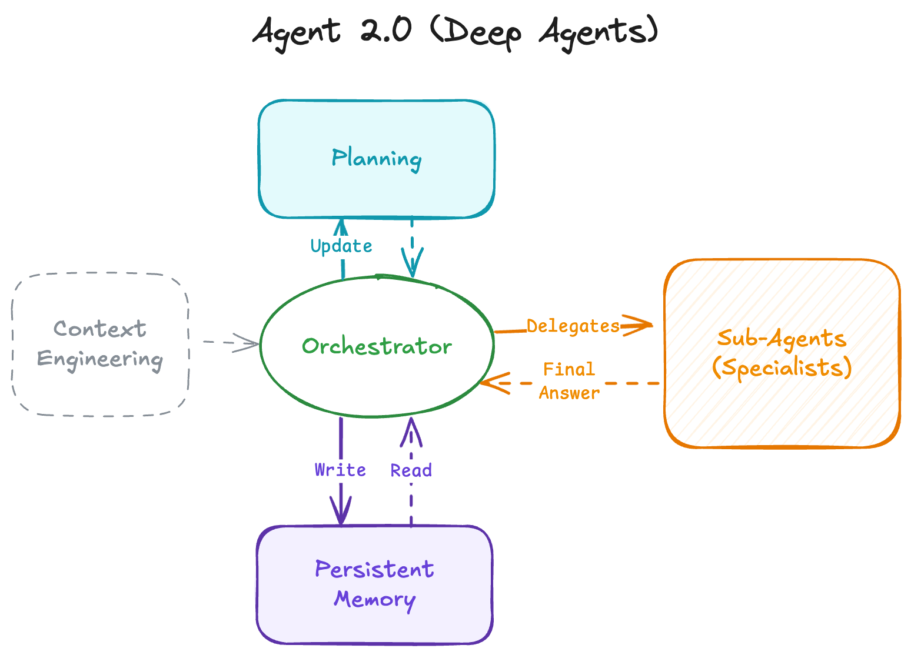
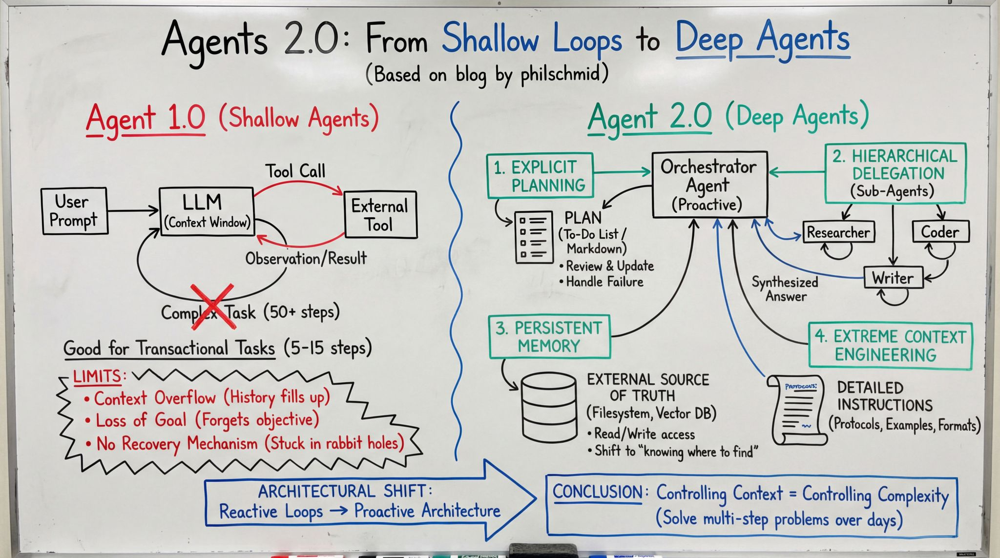

# DeepAgent Context Engineering

Agent 2.0 Paradigm 을 잘 구현하는 DeepAgent 를 활용해서, FileSystem 기반 Context Engineering 을 원활히 수행하는 Research 용 Multi Agent 구성(From LangChain's deepagents library)



## Agent 1.0 vs Agent 2.0



## DeepAgent Technical Guide

[DeepAgent Technical Guide](./DeepAgents_Technical_Guide.md)

## DeepAgent 기반의 Research 수행용 MAS(Multi Agent System)

```bash
research_agent/
├── agent.py                 # 메인 오케스트레이터 (create_deep_agent)
├── prompts.py               # 오케스트레이터 및 Simple SubAgent 프롬프트
├── tools.py                 # tavily_search, think_tool
├── utils.py                 # 노트북 시각화 헬퍼
│
├── researcher/              # 자율적 연구 에이전트 모듈 (NEW)
│   ├── __init__.py          # 모듈 exports
│   ├── agent.py             # create_researcher_agent, get_researcher_subagent
│   └── prompts.py           # AUTONOMOUS_RESEARCHER_INSTRUCTIONS
│
├── skills/                  # Skills 미들웨어
│   └── middleware.py        # SkillsMiddleware (Progressive Disclosure)
│
└── subagents/               # SubAgent 유틸리티
    └── definitions.py       # SubAgent 정의 헬퍼
```

### 핵심 파일 설명

| 파일 | 역할 |
|------|------|
| `agent.py` | 메인 에이전트 생성 및 구성 |
| `researcher/agent.py` | 자율적으로 연구하게끔 구성된 에이전트 |
| `researcher/prompts.py` | "넓게 탐색 → 깊게 파기" 전략으로 구성된 워크플로우 정의 |
| `prompts.py` | 오케스트레이터(Main DeepAgent) 워크플로우 및 위임(Delegation) 전략 |


## DeepAgent UI(Made by LangChain)
```bash
git clone https://github.com/langchain-ai/deep-agents-ui.git
cd deep-agents-ui
npm install -g yarn
yarn install
yarn dev
```


### 참고자료

- [LangChain DeepAgent Docs](https://docs.langchain.com/oss/python/deepagents/overview)
- [LangGraph CLI Docs](https://docs.langchain.com/langsmith/cli#configuration-file)
- [DeepAgent UI](https://github.com/langchain-ai/deep-agents-ui)
- [Agents-2.0-deep-agents](https://www.philschmid.de/agents-2.0-deep-agents)
