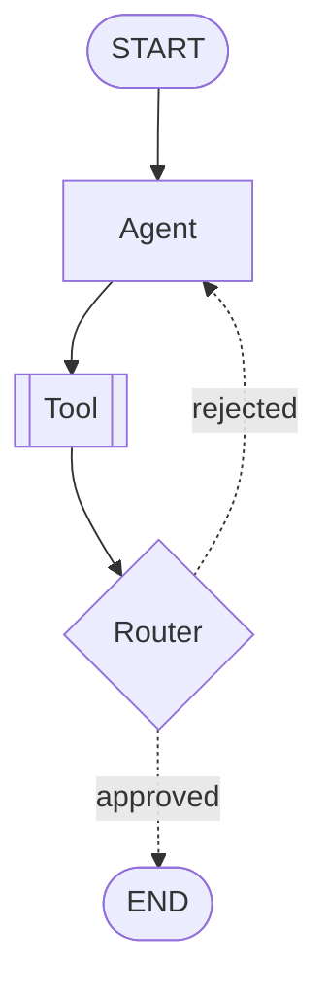
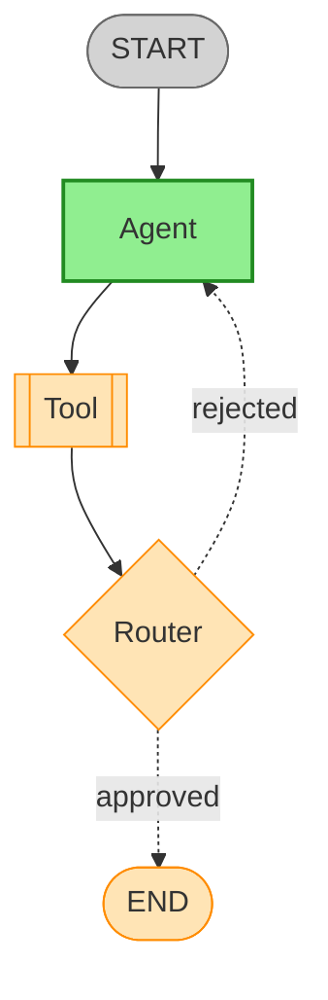

# Pregel Mermaid Visualization Design

> **For Claude:** Use superpowers:executing-plans to implement this design.

**Goal:** Add Mermaid diagram generation to PregelRuntime for workflow visualization, supporting both static debugging and runtime monitoring use cases.

**Tech Stack:** Rust, pure string processing (no external dependencies)

---

## Overview

### Use Cases

| Type | Purpose | Output |
|------|---------|--------|
| **Debugging/Development** | Quick workflow structure check | Mermaid string |
| **Runtime Monitoring** | Track execution state | Mermaid with state colors + Terminal logs |

### Design Decisions

- **Node type distinction:** By shape (not color)
- **Conditional edges:** Dotted lines + labels
- **State colors:** Active=green, Halted=orange, Completed=gray
- **Implementation:** Direct methods on PregelRuntime

---

## API Design

```rust
impl<S, M> PregelRuntime<S, M>
where
    S: WorkflowState,
    M: VertexMessage,
{
    /// Static workflow structure as Mermaid diagram
    /// For debugging - shows nodes and edges only
    pub fn to_mermaid(&self) -> String;

    /// Mermaid diagram with current execution state
    /// For monitoring - shows vertex states with colors
    pub fn to_mermaid_with_state(&self) -> String;

    /// Print execution state to terminal
    /// For monitoring - superstep-by-superstep state tracking
    pub fn log_state(&self, superstep: usize);
}
```

### Usage Examples

```rust
// Debugging: check structure
let mut runtime = PregelRuntime::new();
runtime.add_vertex(...).add_edge("a", "b");
println!("{}", runtime.to_mermaid());

// Runtime monitoring: check state during execution
println!("{}", runtime.to_mermaid_with_state());
runtime.log_state(current_superstep);
```

---

## Mermaid Generation

### Node Shape Mapping

| NodeKind | Mermaid Syntax | Visual |
|----------|---------------|--------|
| Agent | `id[label]` | Rectangle |
| Tool | `id[[label]]` | Subroutine |
| Router | `id{label}` | Diamond |
| SubAgent | `id[(label)]` | Cylinder |
| FanOut | `id[/label\]` | Parallelogram |
| FanIn | `id[\label/]` | Reverse parallelogram |
| Passthrough | `id(label)` | Rounded rectangle |
| START | `id([label])` | Stadium |
| END | `id([label])` | Stadium |

### Implementation

```rust
fn node_to_mermaid_shape(id: &str, kind: Option<&NodeKind>) -> String {
    let safe_id = sanitize_id(id);
    match kind {
        Some(NodeKind::Agent)      => format!("{}[{}]", safe_id, id),
        Some(NodeKind::Tool)       => format!("{}[[{}]]", safe_id, id),
        Some(NodeKind::Router)     => format!("{}{{{{{}}}}}", safe_id, id),
        Some(NodeKind::SubAgent)   => format!("{}[({})]", safe_id, id),
        Some(NodeKind::FanOut)     => format!("{}[/{}\\]", safe_id, id),
        Some(NodeKind::FanIn)      => format!("{}[\\{}/]", safe_id, id),
        Some(NodeKind::Passthrough)=> format!("{}({})", safe_id, id),
        None => format!("{}([{}])", safe_id, id), // START/END
    }
}
```

### Edge Rendering

```rust
fn edge_to_mermaid(from: &str, to: &str, condition: Option<&str>) -> String {
    let from_safe = sanitize_id(from);
    let to_safe = sanitize_id(to);
    match condition {
        Some(label) => format!("    {} -. \"{}\" .-> {}", from_safe, label, to_safe),
        None => format!("    {} --> {}", from_safe, to_safe),
    }
}
```

### ID Sanitization

```rust
fn sanitize_id(id: &str) -> String {
    id.chars()
        .map(|c| if c.is_alphanumeric() || c == '_' { c } else { '_' })
        .collect()
}
```

### Output Example



---

## Runtime Monitoring

### State Color Mapping

| VertexState | CSS Class | Color | Meaning |
|-------------|-----------|-------|---------|
| Active | `active` | Green (#90EE90) | Currently executing |
| Halted | `halted` | Orange (#FFE4B5) | Waiting for messages |
| Completed | `completed` | Gray (#D3D3D3) | Finished |

### Mermaid Style Definitions

```rust
const STYLE_DEFS: &str = r#"
    classDef active fill:#90EE90,stroke:#228B22,stroke-width:2px
    classDef halted fill:#FFE4B5,stroke:#FF8C00,stroke-width:1px
    classDef completed fill:#D3D3D3,stroke:#696969,stroke-width:1px
"#;
```

### State-Aware Mermaid Output



### Terminal Log Output

```rust
pub fn log_state(&self, superstep: usize) {
    println!("[Superstep {}]", superstep);
    for (id, state) in &self.vertex_states {
        let symbol = match state {
            VertexState::Active    => "▶",
            VertexState::Halted    => "⏸",
            VertexState::Completed => "✓",
        };
        println!("  {} {} : {:?}", symbol, id, state);
    }
}
```

**Output:**
```
[Superstep 0]
  ▶ agent : Active
  ⏸ tool : Halted
  ⏸ router : Halted

[Superstep 1]
  ✓ agent : Completed
  ▶ tool : Active
  ⏸ router : Halted
```

---

## Module Structure

### File Organization

```
rust-research-agent/crates/rig-deepagents/src/pregel/
├── mod.rs              # Add: pub mod visualization
├── runtime.rs          # Existing PregelRuntime
├── visualization.rs    # NEW: Mermaid generation logic
├── config.rs           # Optional: log_supersteps flag
└── ...
```

### visualization.rs Structure

```rust
//! Mermaid diagram generation for Pregel workflows

use super::runtime::PregelRuntime;
use super::vertex::{VertexId, VertexState};
use super::message::VertexMessage;
use super::state::WorkflowState;

mod shapes { /* node shape constants */ }
mod styles { /* CSS style constants */ }

fn sanitize_id(id: &str) -> String { ... }
fn render_node(id: &VertexId, kind: Option<&NodeKind>) -> String { ... }
fn render_edge(from: &VertexId, to: &VertexId, label: Option<&str>) -> String { ... }

impl<S, M> PregelRuntime<S, M>
where
    S: WorkflowState,
    M: VertexMessage,
{
    pub fn to_mermaid(&self) -> String { ... }
    pub fn to_mermaid_with_state(&self) -> String { ... }
    pub fn log_state(&self, superstep: usize) { ... }
}

#[cfg(test)]
mod tests { ... }
```

---

## Implementation Tasks

### Task 1: Create visualization.rs module

**Files:** Create `src/pregel/visualization.rs`

**Steps:**
1. Create file with module documentation
2. Add imports from super modules
3. Implement `sanitize_id()` helper function
4. Add unit tests for ID sanitization

### Task 2: Implement node rendering

**Files:** Modify `src/pregel/visualization.rs`

**Steps:**
1. Define shape constants in `shapes` submodule
2. Implement `render_node()` function
3. Handle all NodeKind variants
4. Add START/END special cases
5. Add unit tests for each shape

### Task 3: Implement edge rendering

**Files:** Modify `src/pregel/visualization.rs`

**Steps:**
1. Implement `render_edge()` function
2. Handle conditional edges (dotted + label)
3. Handle unconditional edges (solid)
4. Add unit tests

### Task 4: Implement to_mermaid()

**Files:** Modify `src/pregel/visualization.rs`

**Steps:**
1. Implement `to_mermaid()` method on PregelRuntime
2. Generate `graph TD` header
3. Render all nodes
4. Render all edges
5. Add integration test with sample workflow

### Task 5: Implement state styling

**Files:** Modify `src/pregel/visualization.rs`

**Steps:**
1. Define style constants in `styles` submodule
2. Implement `state_to_class()` helper
3. Implement `to_mermaid_with_state()` method
4. Append classDef declarations
5. Add integration tests

### Task 6: Implement log_state()

**Files:** Modify `src/pregel/visualization.rs`

**Steps:**
1. Implement `log_state()` method
2. Format superstep header
3. Use Unicode symbols for state indicators
4. Add test (capture stdout)

### Task 7: Export and integrate

**Files:** Modify `src/pregel/mod.rs`

**Steps:**
1. Add `pub mod visualization;`
2. Re-export visualization types if needed
3. Run full test suite
4. Run clippy

---

## Verification Checklist

- [ ] `cargo test` - All tests pass
- [ ] `cargo clippy -- -D warnings` - No warnings
- [ ] `to_mermaid()` outputs valid Mermaid syntax
- [ ] `to_mermaid_with_state()` includes state colors
- [ ] `log_state()` prints readable terminal output
- [ ] All NodeKind shapes render correctly
- [ ] Conditional edges show dotted lines + labels
- [ ] Special characters in IDs are handled

---

*Design created 2026-01-02 via brainstorming session*
